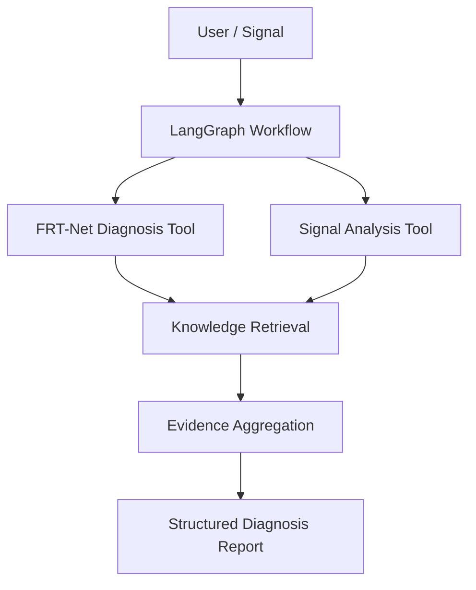

# Fault Diagnosis Agent

A lightweight, reproducible Agent-style workflow built on top of **FRT-Net** for industrial/aircraft power-system fault diagnosis.

This demo turns the existing neural fault classifier into a callable diagnosis tool, combines it with signal analysis and a small retrieval module, and orchestrates the workflow with LangGraph.

## Architecture



## What this demonstrates

- **Model as Tool**: wraps FRT-Net inference behind a clean `predict(signal)` interface.
- **Signal Tool**: extracts interpretable statistics and frequency-domain evidence.
- **RAG-style Retrieval**: retrieves the most relevant fault knowledge from local Markdown documents without requiring an external API.
- **LangGraph Orchestration**: coordinates diagnosis, analysis, retrieval and reporting as a stateful workflow.
- **Reproducible Demo Mode**: runs even when the private training dataset or checkpoint is unavailable.

## Project Structure

```text
agent_demo/
├── README.md
├── requirements.txt
├── run_demo.py
├── agent/
│   ├── __init__.py
│   ├── graph.py
│   ├── state.py
│   └── report.py
├── tools/
│   ├── __init__.py
│   ├── frt_diagnosis.py
│   ├── signal_analysis.py
│   └── knowledge_retrieval.py
├── knowledge/
│   ├── README.md
│   ├── general_fault_diagnosis.md
│   └── maintenance_guidelines.md
└── evaluation/
    ├── README.md
    └── benchmark_cases.json
```

## Quick Start

```bash
cd agent_demo
pip install -r requirements.txt
python run_demo.py
```

The default demo uses a synthetic signal and **demo diagnosis mode**, so it does not require private checkpoints or datasets.

## Connect a Real FRT-Net Checkpoint

```python
from tools.frt_diagnosis import FRTDiagnosisTool

frt_tool = FRTDiagnosisTool(
    checkpoint_path="../outputs/best_model.pth",
    config_path="../FRT-NET/Config/config.yaml",
    project_root="../FRT-NET",
)

result = frt_tool.predict(signal)
print(result)
```

If the checkpoint is unavailable, the tool falls back to demo mode and clearly marks the result as non-production output.

## Example Output

```text
Fault Diagnosis Agent Report
----------------------------
Diagnosis source : demo
Predicted class  : demo_fault_high_frequency
Confidence       : 0.81
RMS              : 0.74
Peak             : 1.43
Dominant freq.   : 120.0 Hz

Evidence:
- High-frequency spectral energy is elevated.
- Retrieved maintenance guidance recommends checking power-quality disturbance, sensor integrity and connector conditions.
```

## Roadmap

- [x] Wrap FRT-Net as a callable diagnosis tool
- [x] Add signal-domain analysis
- [x] Add local retrieval over fault knowledge
- [x] Add LangGraph workflow
- [x] Add reproducible demo and benchmark cases
- [ ] Replace demo labels with the real 15-class mapping
- [ ] Add real checkpoint evaluation and confidence calibration
- [ ] Add embedding-based RAG (FAISS / sentence-transformers)
- [ ] Add LLM tool-calling and natural-language reasoning
- [ ] Add Agent evaluation: tool-call success, factuality and hallucination rate

## Open-source Positioning

This module is intended to evolve into an educational **Fault Diagnosis Agent** tutorial that connects deep-learning diagnosis models with Agent orchestration, retrieval and interpretable signal tools.
